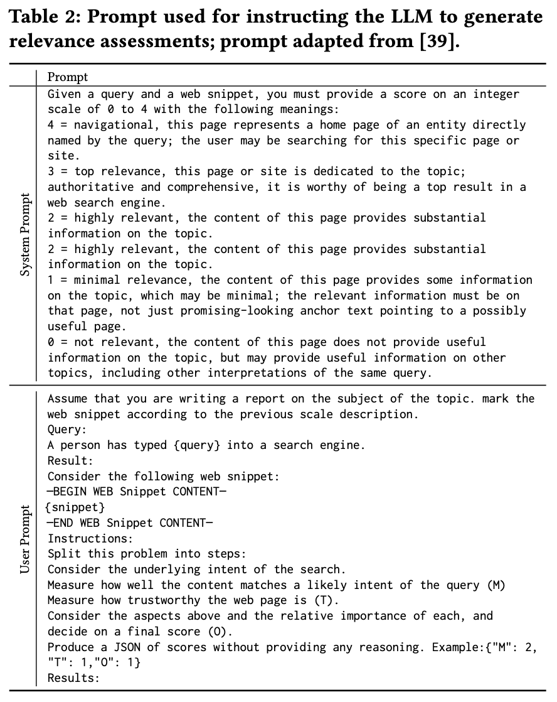
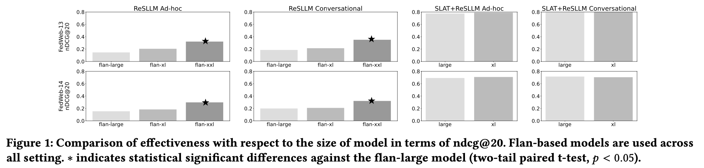

# SLAT-ResLLM
Code Repo for SLAT-ResLLM


## Result Appendix

### Prompts


---



---


---

### Results



---


---


--------------------------------------------
## Code for Reproduction


### Enviroment Setup
1. Use Conda enviroment with python=3.10
2Install all required package from requirements.txt by running `pip install -r requirements.txt`

### Prepare Data
```
Download data from Trec Greatest Hit.
Comming soon
```


### ResLLM

#### Resource Selection using ResLLM (except when similar snippets are used to represent resource)
```
python3 source_selection.py \
    --queries $queries_file \ query file .csv
    --engines $engine_file \  engine file .csv
    --query-representation $query_representation \ 'query' or 'decription'
    --llm $llm \ see source_selection.py to see all options
    --model_path $model_path \ path of llm (or huggingface path)
    --source-representation $source_representation \ 'name' or 'name_description'
    --out_file $out_file \ output file
    --batch $batch batch size
```


#### Resource selection using similar snippets

1. First find similar snippets using bge model
```
python3 query_searching.py --queries "$queries" \ 
  --search_folder "$search_folder" \  
  --query_representation "$query_representation" \
  --search_type "$search_type" \
  --write_file "$out_file" \
  --qids "$qids"  all the qids, this is for parsing only a portion of qids in queries.

```

2. Then run the following code to select resources
```
python3 source_selection.py \
    --queries $queries_file \
    --engines $engine_file \
    --query-representation $query_representation \ 'query' or 'decription'
    --llm $llm \  all models in the paper
    --model_path $model_path \
    --source-representation $source_representation \ 'example_snippet' or 'name_snippet'
    --out_file $out_file \
    --batch $batch \
    --search_query_result $search_query_result \  search result path
    --snippet_folder $snippet_folder \ folder of sample snippets (from dataset)
    --search_top_n $top_n 
```
 
### SLAT+ResLLM

1. Relevance Labeling
```
python3 relevance_labeling.py \
    --input_folder $input_folder \
    --qid_file $queries_file \
    --llm $llm \
    --model_path $model_path \
    --out_file $out_file
```

2. Come up with conversational query from ad-hoc query (optional), we have our test one in [here](data/conversational_queries/all_description.jsonl)
```
cd tools
python3 write_description_for_query.py \
    --input_folder $input_folder \
    --out_file $out_file \
    --snippet_labeled_folder $snippet_labeled_folder \
    --model_path $model_path 
cd ..
```

2. create training data
```

cd tools
python3 create_training_data.py \
    --input_folder $input_folder \
    --snippet_file $snippet_file \
    --queries_folder $queries_folder \
    --snippet_folder $snippet_folder \
    --engine_file $engine_file \
    --query_representation $query_representation \
    --source_representation $source_representation \
    --query_description_input $query_description_input \
    --out_file $out_file
cd ..
```

3. Train model
```
When the model is flan-based.

cd fine_tune_flan
python3 train.py --base_model $model_path \
  --output_path $output_dir \
  --data $input_dir \
  --batch_size $batch \
  --num_workers 8 \
  --max_epochs $max_epochs \
  --num_gpus 1

python3 convert_lightning_to_pytorch.py \
  --model_type $model_path \
  --model_dir $output_dir

cd ..

when the model is decoder-based (or llama-based)
cd fine_tune_llama

torchrun --nproc_per_node=2 --master_port=12345 train.py \
    --model_name_or_path "$model_path" \
    --data_path "$input_file" \
    --bf16 True \
    --output_dir "$output_dir" \
    --num_train_epochs 1 \
    --per_device_train_batch_size 3 \
    --per_device_eval_batch_size 1 \
    --gradient_accumulation_steps 2 \
    --evaluation_strategy "no" \
    --save_strategy "steps" \
    --save_steps 3000 \
    --save_total_limit 2 \
    --learning_rate 2e-5 \
    --cache_dir cache/ \
    --weight_decay 0. \
    --warmup_ratio 0.03 \
    --lr_scheduler_type "cosine" \
    --logging_steps 10 \
    --model_max_length 512 \
    --fsdp "full_shard auto_wrap" \
    --fsdp_transformer_layer_cls_to_wrap 'LlamaDecoderLayer'
  
```

4. Resource Selection (same as ReSLLM, with just tuned model)